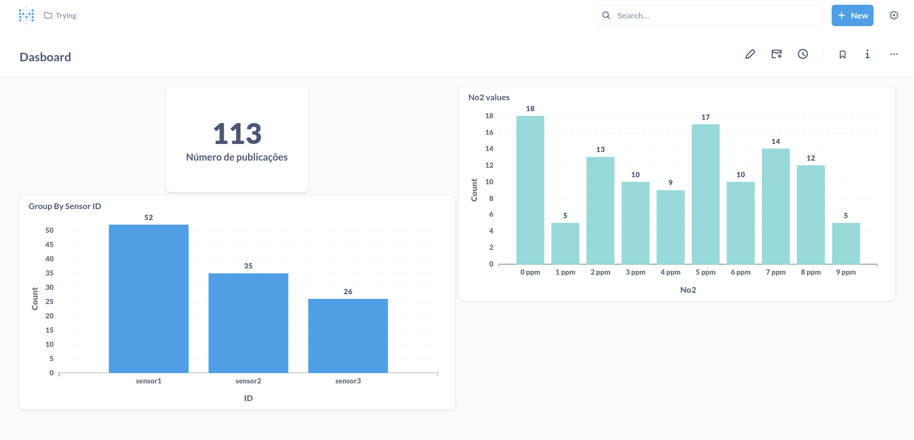

# Integração do simulador com Metabase

## Introdução

Nessa atividade, foi desenvolvida a integração entre o simulador MQTT e um dashboard desenvolvido usando o Metabase, com persistência de dados em um banco de dados MongoDB, usando o MongoDB Atlas, um serviço de banco de dados na nuvem.

## Estrutura do Projeto

O projeto foi desenvolvido em Golang, e a estrutura do projeto é a seguinte:

```bash
.
├── README.md
├── go.mod
├── go.sum
├── .env
├── .env.example
├── .gitignore
├── common
│   ├── connect.go
│   ├── env.go
│   └── options.go
├── database
│   ├── client.go
│   └── db_publish.go
├── main
│   └── main.go
├── metabase
│   └── metabase.db
├── publisher
│   └── publisher.go
├── static
│   └── metabase.png
├── subscriber
│   └── subscriber.go
└── tests
    ├── connect_mqtt_test.go
    ├── data_validation_test.go
    ├── env_test.go
    ├── ping_db_test.go
    ├── publish_mqtt_test.go
    └── time_test.go
```

## Como utilizar o projeto

Crie um arquivo `.env` na raiz do projeto, com base no arquivo `.env.example`

### MQTT

Para utilizar o projeto, é necessário ter o Golang instalado na máquina. Para instalar o Golang, siga as instruções no [site oficial](https://golang.org/doc/install).

Após a instalação do Golang, instale as dependências do projeto:

```bash
go mod download
```

Após a instalação das dependências, acesse o diretório `main` e execute o comando:

```bash
go run main.go
```

Após a execução do comando, o publisher e o subscriber estarão em execução, e os dados estarão sendo publicados e consumidos, utilizando o HiveMQ Cloud como broker MQTT.

### Metabase

Para utilizar o Metabase, é necessário ter o Docker instalado na máquina. Para instalar o Docker, siga as instruções no [site oficial](https://docs.docker.com/get-docker/).

Após a instalação do Docker, execute o seguinte comando, na raiz do projeto:

```bash
docker-compose up
```

Após a execução do comando, o Metabase estará em execução, e o dashboard estará disponível em `http://localhost:3000`.

### MongoDB Atlas

O banco de dados utilizado no projeto é o MongoDB, e a persistência dos dados é feita no MongoDB Atlas, um serviço de banco de dados na nuvem.

Para utilizar o MongoDB Atlas, é necessário criar uma conta no [site oficial](https://www.mongodb.com/cloud/atlas).

Após a criação da conta, crie um cluster, e adicione um usuário ao cluster, com permissões de leitura e escrita.

Seguindo esses passos, edite o arquivo `.env` e adicione as informações do cluster e do usuário.

## Demonstração

A seguir, é apresentada uma imagem do dashboard desenvolvido no Metabase, com os dados publicados pelo simulador MQTT.



Veja o banco de dados MongoDB Atlas, com os dados persistidos:


Em seguida, está apresentada a demonstração do funcionamento do projeto:
